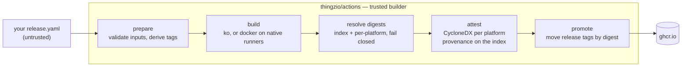

# thingzio/actions

Reusable GitHub Actions workflows for the `thingzio` organization.

Publish a signed, SBOM-attested container image from any repository by adding
about ten lines to one workflow file. No secrets to create, no supply-chain
boilerplate to copy, and the result verifies at **SLSA v1.0 Build Level 3**.

```yaml
name: Release
on:
  push:
    tags: ['v*.*.*']

permissions:
  contents: read

jobs:
  image:
    permissions:
      contents: read
      packages: write
      id-token: write
      attestations: write
    uses: thingzio/actions/.github/workflows/build-ko.yaml@<commit-sha>  # v1.0.0
    with:
      image: thingzio/my-app
      main: ./cmd/my-app
```

That publishes `ghcr.io/thingzio/my-app` tagged `v1.2.3`, `v1.2`, `v1` and
`latest`, with a CycloneDX SBOM attested to each platform manifest and SLSA
build provenance attested to the index.

## Contents

| Workflow | Use it when |
|---|---|
| [`build-ko.yaml`](.github/workflows/build-ko.yaml) | The repository is pure Go. ko cross-compiles natively, so a multi-platform image comes out of a single job with no Dockerfile and no emulation. |
| [`build-docker.yaml`](.github/workflows/build-docker.yaml) | The image needs a Dockerfile. Each architecture builds on its own native runner and the results are merged into an index. |

Both produce the same evidence and are verified the same way.

## Choosing between them

Reach for `build-ko` whenever the answer is "a Go binary in a minimal base
image". It is faster, needs no Dockerfile to maintain, produces a smaller
image, and its arm64 build is a cross-compile rather than an emulation.

Reach for `build-docker` when the image needs system packages, a non-Go
runtime, multiple build stages, or anything else a Dockerfile expresses and ko
does not.

## Inputs

Shared by both workflows:

| Input | Default | Notes |
|---|---|---|
| `image` | *required* | Repository path **without** the registry host, e.g. `thingzio/my-app`. A value carrying a host is accepted only if it matches `registry`. |
| `registry` | `ghcr.io` | |
| `platforms` | `linux/amd64,linux/arm64` | `linux/amd64` and `linux/arm64` only. |
| `tags` | derived | Newline- or comma-separated; replaces the derived set entirely. |
| `labels` | — | Extra OCI labels, one `key=value` per line. |
| `push` | `true` | Forced to `false` on fork pull requests. |
| `sbom` | `true` | |
| `provenance` | `true` | |
| `{ko,cosign,syft,crane}_version` | from [`.versions.yaml`](.versions.yaml) | Per-call override for emergency pinning. |

`build-ko` adds `main` (default `.`), `working_directory`, `go_version`
(default: your `go.mod`), `base_image`, and `ko_flags`.

`build-docker` adds `dockerfile` (default `./Dockerfile`), `context`, `target`,
`build_args`, and `cache`.

Both accept optional `registry_username` / `registry_password` secrets. Omit
them for GHCR — the job's `GITHUB_TOKEN` is used.

## Outputs

| Output | Example |
|---|---|
| `digest` | `sha256:1c9a…` — index digest |
| `image_ref` | `ghcr.io/thingzio/my-app@sha256:1c9a…` — deploy this, not a tag |
| `tags` | newline-separated tags published |
| `platform_digests` | `{"linux/amd64":"sha256:…","linux/arm64":"sha256:…"}` |

## Tags

| Trigger | Tags published |
|---|---|
| tag push `v1.2.3` | `v1.2.3`, `v1.2`, `v1`, `latest` |
| tag push `v1.2.3-rc.1` | `v1.2.3-rc.1` only |
| push to default branch | `sha-<short>`, and the branch name |
| push to another branch | `sha-<short>` |
| pull request | `pr-<number>` |

A prerelease never claims `latest` or a moving major tag.

## Verifying a published image

```bash
gh attestation verify oci://ghcr.io/thingzio/my-app:v1.2.3 \
  --repo thingzio/my-app \
  --signer-repo thingzio/actions \
  --signer-workflow .github/workflows/build-ko.yaml
```

`--repo` says where the attestation is stored (your repository).
`--signer-repo` and `--signer-workflow` assert who signed it (this build
definition). Separating the two is what stops anyone from minting provenance
that claims these workflows produced their image.

See [docs/verification.md](docs/verification.md) for the SBOM, the cosign
equivalent, and how to verify from a Kubernetes admission policy.

## How it works



Three properties are worth knowing about:

**Digest-first publishing.** Every build pushes to a run-unique candidate tag,
signs the resulting digests, and only then moves the release tags onto the
attested digest. A failed signing step cannot leave a published `latest`, and a
re-run re-points the same tags at the same digest.

**SBOMs go on platform manifests, not the index.** An SBOM describes exactly one
root filesystem. A referrer descriptor has no name field, so two CycloneDX
documents attached to one index digest are indistinguishable in a referrers
listing, and a consumer that resolved `linux/amd64` looks for referrers on
*that* manifest. Provenance goes on the index, because it describes the build
that produced the whole image.

**Fail-closed digest checks.** Before anything is signed: every digest must be
well-formed, each platform digest must differ from the index digest, and the
platform digests must differ from each other. A release that silently lost an
architecture fails the build instead of shipping two SBOMs pinned to the same
subject.

## SLSA Build Level 3

These workflows reach Build Level 3, and the reason is structural rather than
incidental: the build and the attestation run inside a reusable workflow, so the
calling repository cannot inject a step beside the signing step. Sigstore
records the *reusable* workflow as the signer, which is why the verification
above can pin on `--signer-repo`.

Two consequences you will notice in the input surface:

- **There is no `build_command`, `pre_build_script` or `post_steps` input.** Any
  of them would let a caller run code next to the OIDC token and forge
  provenance naming this build definition. `ko_flags` is a closed allowlist for
  the same reason.
- **You cannot choose the runner.** Platforms map to runner labels through an
  allowlist. A caller-chosen runner could be a machine the caller controls,
  which defeats the isolation the level rests on.

> **The composite actions in `.github/actions/` are Build Level 2, not 3.**
> They are public and usable, but running them from your own workflow means you
> control the job, so the isolation argument does not apply. Use the reusable
> workflows when the level matters.

Full reasoning, including what would downgrade you: [docs/slsa.md](docs/slsa.md).

## Pinning

Pin to a **commit SHA** with a version comment:

```yaml
uses: thingzio/actions/.github/workflows/build-ko.yaml@1a2b3c4…  # v1.0.0
```

This is what this repository does with every action it uses, and what OpenSSF
Scorecard's pinned-dependencies check expects. Renovate and Dependabot both
understand the trailing comment and will raise bump PRs.

The floating `@v1` tag is supported for teams that prefer the lower-effort
option. It moves on every compatible release, so you inherit changes without
review — a deliberate trade-off, not an oversight.

Because the certificate identity contains the workflow filename, **renaming a
workflow file is a breaking change** even when its inputs are unchanged.

## Fork pull requests

Fork pull requests get a read-only token and no OIDC token, so publishing and
signing are impossible by construction. Rather than failing on the first
registry write with an opaque 403, the workflows detect this, set `push: false`,
and say so in the job summary. External contributors still get a real build.

`pull_request_target` is not used anywhere in this repository and must not be
added to it.

## Local development

```bash
make verify   # everything CI runs: shell tests, actionlint, yamllint, shellcheck
make test     # the shell test suite
make lint     # linters only
make versions # print every pinned version
```

Tools install into `.bin/` at the versions pinned in
[`.versions.yaml`](.versions.yaml), so a laptop and a runner lint with the same
binaries. The test suite is plain bash with no framework — see
[CONTRIBUTING.md](CONTRIBUTING.md) for why.

## Repository layout

```
.versions.yaml                  single source of truth for tool versions
.github/workflows/              build-ko, build-docker (the product)
                                ci, selftest, codeql, scorecard, release (this repo's own)
.github/actions/                composite actions the workflows compose
scripts/                        validation and tag logic, unit tested
scripts/actions/                the shell behind each composite action
test/                           zero-dependency shell test harness
testdata/                       fixtures the selftest builds for real
```

## Adding a workflow to this repository

Every reusable workflow here must: declare `permissions` at the job level,
set a `timeout-minutes`, pin every `uses:` to a commit SHA, accept no input
that becomes shell, and be covered by `selftest.yaml` building something real.
See [CONTRIBUTING.md](CONTRIBUTING.md).

## Documentation

| | |
|---|---|
| [Verification](docs/verification.md) | Every way to check an image, plus admission-policy enforcement |
| [SLSA](docs/slsa.md) | What level, why it holds, and what would break it |
| [Adoption](docs/migration.md) | Moving an existing repository onto these workflows |
| [Org allowlist](docs/allowlist.md) | Actions policy settings a consuming org needs |
| [Contributing](CONTRIBUTING.md) | Setup, the trust-boundary rules, how tests work |
| [Releasing](RELEASING.md) | For maintainers |
| [Security policy](SECURITY.md) | Reporting, scope, and posture |
| [Maintainers](MAINTAINERS.md) | Who to ask |
| [Rulesets](.github/rulesets/README.md) | Branch and tag protection as code |

## License

[Apache 2.0](LICENSE). See [NOTICE](NOTICE).
